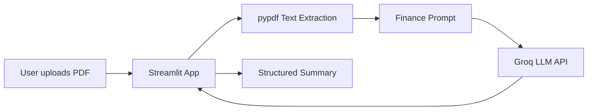

# Phase 1 - Beginner MVP

## 1. Phase Objective

Build the smallest useful version of **AI SEC Filing + Earnings Call Analyzer**:

1. Upload a SEC filing, annual report, or investor presentation PDF.
2. Extract readable text from the PDF.
3. Send the text to Groq with a structured finance prompt.
4. Display a beginner-friendly filing summary in Streamlit.

This phase deliberately avoids RAG, embeddings, vector databases, user accounts, and long-term memory.

## 2. Concepts Learned

- LLM API calls
- System prompts and user prompts
- Environment variables
- PDF text extraction
- Streamlit widgets
- Basic finance filing analysis

Finance terms:

- **10-K**: annual SEC report.
- **10-Q**: quarterly SEC report.
- **MD&A**: management's explanation of results, trends, risks, and liquidity.
- **Revenue drivers**: what causes sales to grow or decline.
- **Risk factors**: disclosures about what could hurt the company.

## 3. Architecture Overview



Why this architecture:

- Streamlit is fast and beginner-friendly.
- `pypdf` is free and local.
- Groq is fast and free-tier friendly.
- Services are separate from UI code so the project can grow cleanly.

## 4. Folder Structure

```text
app/
  main.py
src/
  services/
    llm_service.py
    phase1_filing_summary.py
  utils/
    config.py
docs/
  PHASE_1_BEGINNER_MVP.md
tests/
requirements.txt
.env.example
```

## 5. Step-by-Step Implementation

1. Create `.env` from `.env.example`.
2. Add `GROQ_API_KEY`.
3. Run the Streamlit app.
4. Upload a text-based PDF.
5. Review extracted text metrics.
6. Generate the summary.

## 6. Full Code

Core flow:

```python
extraction = extract_pdf_text(pdf_bytes, document_name)
summary = summarize_filing(extraction)
```

The app separates:

- UI: `app/main.py`
- Groq access: `src/services/llm_service.py`
- PDF and prompt logic: `src/services/phase1_filing_summary.py`
- Config: `src/utils/config.py`

## 7. Debugging Tips

If Groq is not configured, check `.env`.

If the PDF has no readable text, it may be scanned or image-based.

Read stack traces from bottom to top. The bottom line usually tells you the error type.

## 8. Git Workflow

```powershell
git init
git checkout -b phase-1-beginner-mvp
git add .
git commit -m "Add phase 1 SEC filing summarizer"
```

Do not commit `.env`.

## 9. Deployment Notes

Good free-tier option: Streamlit Community Cloud.

Deployment checklist:

- Push to GitHub.
- Add `GROQ_API_KEY` as a deployment secret.
- Confirm `requirements.txt` installs.
- Keep the financial disclaimer visible.

## 10. Suggested Exercises

1. Upload two different annual reports and compare the summaries.
2. Add a `Questions for Management` section to the prompt.
3. Try a scanned PDF and observe the extraction failure.
4. Change the output length in the prompt.
5. Write down three hallucination risks in this Phase 1 design.
