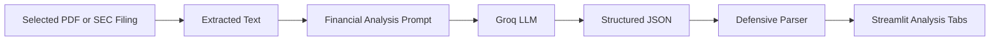

# Phase 2 - Financial Intelligence Layer

## 1. Phase Objective

Phase 2 turns the app from a general filing summarizer into a finance-oriented analysis tool.

The app now extracts:

- Business overview
- Revenue drivers
- Risk factors
- MD&A themes
- Key financial or operating metrics
- Management tone
- Investment insights
- Analysis limitations

This is still pre-RAG. We are not using embeddings or a vector database yet. The goal is to learn structured outputs before adding retrieval.

## 2. Concepts Learned

AI engineering concepts:

- Prompt templates
- Structured JSON outputs
- Defensive JSON parsing
- Hallucination reduction through explicit schema rules
- Fallback handling when the model returns invalid output

Finance concepts:

- **Revenue drivers**: what causes sales to grow or decline.
- **MD&A**: management's explanation of results, risks, liquidity, and trends.
- **Key metrics**: figures or operating indicators that help explain company performance.
- **Tone analysis**: whether management language sounds confident, cautious, mixed, or neutral.
- **Investment insights**: analyst-style observations, not buy/sell recommendations.

## 3. Architecture Overview



Why this design:

- JSON makes model output easier for software to use.
- Separate tabs match analyst workflows.
- Defensive parsing keeps the app usable when model output is imperfect.
- We still keep infrastructure light and student-budget friendly.

## 4. Folder Structure

```text
src/services/
  financial_analysis_service.py   Phase 2 structured analysis
  phase1_filing_summary.py        Phase 1 summary flow
  sec_edgar_service.py            SEC 10-K and 10-Q fetcher

tests/
  test_financial_analysis_service.py
```

## 5. Step-by-Step Implementation

1. Reuse the selected document from Phase 1.5.
2. Build a JSON-only prompt with finance-specific fields.
3. Call Groq with a careful finance analyst system prompt.
4. Parse the response into Python dataclasses.
5. Render the result in Streamlit tabs.

## 6. Full Code

Core flow:

```python
analysis = analyze_financial_document(extraction)
```

The result is a structured object:

```python
FinancialAnalysisResult(
    business_overview="...",
    revenue_drivers=[...],
    risks=[...],
    mda_themes=[...],
    key_metrics=[...],
    tone=ToneAnalysis(...),
    investment_insights=[...],
    limitations=[...],
)
```

## 7. Debugging Tips

If the model returns invalid JSON:

- The app keeps the raw model response.
- The parser returns a limitation instead of crashing.
- Tighten the prompt or reduce the text excerpt if needed.

If the analysis looks generic:

- The model may not have enough relevant context.
- This is one reason Phase 3 RAG will matter.
- RAG will retrieve sections such as Risk Factors or MD&A instead of using only the first excerpt.

## 8. Git Workflow

Recommended feature workflow:

```powershell
git checkout -b phase-2-financial-intelligence
git add .
git commit -m "Add structured financial analysis"
git push -u origin phase-2-financial-intelligence
```

For this learning project, committing directly to `main` is acceptable early on, but branches are better once features get larger.

## 9. Deployment Notes

Phase 2 still works on free-tier infrastructure:

- Streamlit app
- Groq API
- No database required
- No vector store required yet

Watch for:

- Groq token limits
- SEC request limits
- Invalid or incomplete model JSON

## 10. Suggested Exercises

1. Fetch AAPL 10-K and 10-Q and compare the risks.
2. Add a new field called `questions_for_management`.
3. Change risk severity labels to `low`, `medium`, `high`, and `critical`.
4. Add a download button for the structured analysis JSON.
5. Identify where RAG would improve the quality of each tab.
