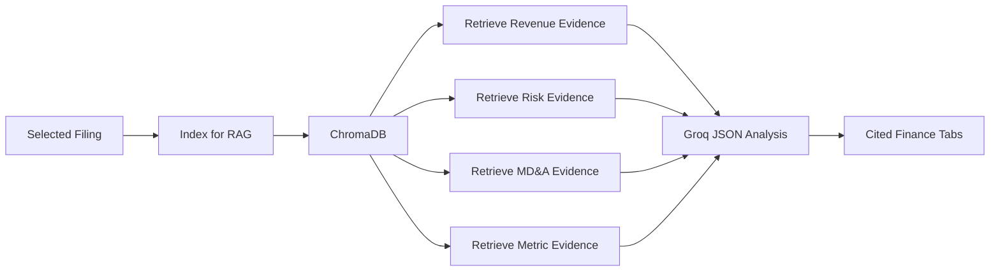

# Phase 3.5 - RAG-Powered Financial Intelligence

## 1. Phase Objective

Phase 3.5 improves the Financial Intelligence tab by using RAG for each finance section.

Instead of asking the model to analyze one generic excerpt, the app now retrieves targeted evidence for:

- Business overview
- Revenue drivers
- Risks
- MD&A themes
- Key metrics
- Management tone
- Investment insights

Each section produces cited findings with evidence, confidence, and finance relevance.

## 2. Concepts Learned

- Section-specific retrieval
- Citation-backed structured outputs
- Evidence-first financial analysis
- Confidence labeling
- Why retrieval quality affects downstream analysis

## 3. Architecture Overview



Why this is better than Phase 2:

- Phase 2 uses one shortened excerpt.
- Phase 3.5 retrieves relevant passages for each section.
- Each finding includes a citation.
- The app can admit limitations when retrieved evidence is weak.

## 4. Folder Structure

```text
src/services/
  rag_financial_analysis_service.py

tests/
  test_rag_financial_analysis_service.py
```

## 5. Step-by-Step Usage

1. Fetch or upload a filing.
2. Choose the document.
3. Click `Index for RAG`.
4. Click `Generate RAG Financial Intelligence`.
5. Review the `RAG Financial Intelligence` tab.
6. Open retrieved evidence under each section.

## 6. Output Shape

Each finding includes:

```json
{
  "finding": "Concise analyst finding",
  "evidence": "Short source-backed evidence",
  "citation": "[Source 1]",
  "confidence": "high",
  "finance_relevance": "Why this matters for company analysis"
}
```

## 7. Debugging Tips

If findings are weak:

- Make sure the document was indexed.
- Ask whether the retrieved chunks actually contain that topic.
- Try increasing `top_k`.
- Improve the section query.

If citations seem irrelevant:

- Retrieval quality is likely the issue.
- Chunk size may be too large or too small.
- Section-aware chunking can improve this in a later phase.

## 8. Finance Relevance

This is closer to how analysts work:

- Find evidence first.
- Extract the finding.
- Explain why it matters.
- Keep track of source support.

That is much safer than asking an LLM to summarize a full filing from memory or from a random excerpt.
