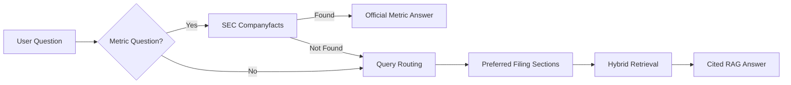

# Phase 3.7 and 3.8 - Section-Aware RAG and XBRL Facts

## Objective

Improve retrieval quality for both narrative filing questions and exact financial metric questions.

Phase 3.7 adds section-aware retrieval:

- Detect rough filing sections such as risk factors, MD&A, financial statements, business, and segments.
- Route questions to likely sections.
- Boost chunks from relevant sections.

Phase 3.8 adds SEC XBRL companyfacts:

- Fetch official SEC structured facts by ticker.
- Answer supported metric questions from XBRL before falling back to RAG.
- Reduce reliance on flattened filing tables.

## Why This Matters

Different finance questions belong in different parts of a filing:

- Revenue and income: financial statements, MD&A, segment tables
- Risks: Item 1A / risk factors
- Liquidity: MD&A and cash flow statement
- Segments: segment notes and business discussion

For exact metrics, XBRL is even better than RAG because it is structured data.

## Architecture

## Current XBRL Metrics

Supported metrics:

- Revenue / net sales
- Net income
- Operating income
- Operating cash flow
- Assets

## Limitations

- Section detection is heuristic, not perfect.
- SEC text extraction still flattens tables.
- XBRL tag availability varies by company and reporting period.
- Future work can add richer XBRL taxonomy mapping and table rendering.

## Usage

1. Fetch a ticker such as `AAPL`.
2. Select the `10-K`.
3. Click `Index for RAG`.
4. Ask: `what was the latest revenue for Apple?`
5. The app first checks SEC XBRL companyfacts, then falls back to section-aware RAG.
