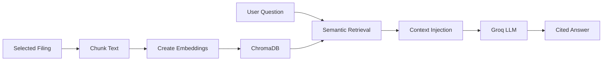

# Phase 3 - RAG Architecture

## 1. Phase Objective

Phase 3 adds Retrieval-Augmented Generation, or RAG.

Instead of sending one shortened excerpt to Groq, the app now:

1. Splits a filing into overlapping chunks.
2. Converts chunks into embeddings.
3. Stores chunks in ChromaDB.
4. Retrieves relevant chunks for a user question.
5. Sends only retrieved context to Groq.
6. Shows an answer with source citations.

## 2. Concepts Learned

- **Chunking**: splitting a long filing into smaller passages.
- **Chunk overlap**: repeating some text across chunks so important context is not cut off.
- **Embeddings**: numeric representations of text meaning.
- **Vector database**: a database optimized for similarity search.
- **Semantic search**: finding text by meaning, not exact keyword match.
- **Context injection**: putting retrieved chunks into the LLM prompt.
- **Citation-aware answers**: forcing the answer to point back to retrieved sources.

## 3. Architecture Overview



Why RAG matters in finance:

- Filings are too long to send fully to an LLM.
- Finance answers need evidence.
- Hallucinations can mislead investment analysis.
- Different questions require different filing sections.

Example:

- Risk questions should retrieve risk factor chunks.
- Revenue questions should retrieve MD&A and segment discussion chunks.
- Liquidity questions should retrieve cash flow and debt discussion chunks.

## 4. Folder Structure

```text
src/rag/
  pipeline.py              Chunking, embeddings, ChromaDB, retrieval, RAG answers

data/vector_store/
  .gitkeep                 Local Chroma persistence folder

tests/
  test_rag_pipeline.py
```

## 5. Step-by-Step Implementation

1. User selects a filing.
2. User clicks `Index for RAG`.
3. The app chunks the extracted text.
4. ChromaDB stores text chunks and embeddings.
5. User asks a question.
6. The app retrieves top matching chunks.
7. Groq receives the question plus retrieved context.
8. The app displays the cited answer and source excerpts.

## 6. Full Code

Core flow:

```python
rag = RagPipeline()
chunk_count = rag.ingest_extraction(extraction)
chunks = rag.retrieve("What are the key risks?", top_k=5)
answer = answer_question_with_rag("What are the key risks?", chunks)
```

## 7. Debugging Tips

If indexing fails:

- Check that `chromadb` and `sentence-transformers` are installed.
- Check `data/vector_store` permissions.
- Try a smaller document first.

If answers are weak:

- Ask a more specific question.
- Increase `top_k`.
- Improve chunking strategy.
- Later, add section-aware chunking for Risk Factors and MD&A.

If citations look irrelevant:

- Retrieval may have selected weak chunks.
- The embedding model may not be strong enough.
- Chunk size may be too large or too small.

## 8. Git Workflow

Suggested commit:

```powershell
git add .
git commit -m "Add Phase 3 RAG architecture"
git push
```

## 9. Deployment Notes

Phase 3 adds heavier dependencies:

- ChromaDB
- sentence-transformers
- local vector storage

Deployment implications:

- First startup can be slower.
- Free hosting may have memory limits.
- Vector store persistence may need configuration.
- For portfolio demos, local ChromaDB is still a good low-cost choice.

## 10. Suggested Exercises

1. Index AAPL 10-K and ask about risk factors.
2. Index AAPL 10-Q and ask what changed recently.
3. Compare RAG answers with the Phase 1 summary.
4. Change chunk size from `1200` to `800` and observe retrieval.
5. Ask a question not answered by the filing and check whether the app admits missing context.
