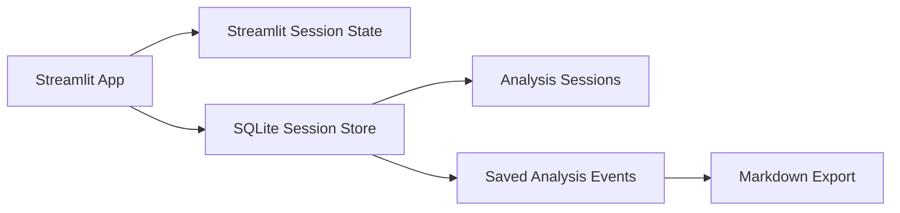

# Phase 4 - Memory and State Management

## Objective

Phase 4 turns the app into a lightweight analyst workspace.

The app now saves:

- Analysis sessions
- Selected ticker context
- Generated Phase 1 summaries
- Phase 2 structured analysis
- RAG financial intelligence
- RAG questions and answers
- Markdown exports for saved research notes

## Why This Matters

Real finance workflows are not one-question interactions. Analysts build a research trail:

```text
Company -> Filings reviewed -> Questions asked -> Evidence -> Findings -> Notes
```

Phase 4 makes that trail persistent with local SQLite storage.

## Architecture



## Memory Types

Short-term memory:

- Active selected document
- Last indexed document
- Current RAG answer
- Current generated analysis

Long-term memory:

- Saved sessions
- Saved summaries
- Saved Q&A history
- Exportable analysis notes

## Files Added

```text
src/storage/session_store.py
data/sqlite/.gitkeep
tests/test_session_store.py
docs/PHASE_4_MEMORY_STATE.md
```

## How To Use

1. Open the app.
2. Create a session in the sidebar.
3. Fetch or upload a filing.
4. Generate summaries, financial analysis, or RAG answers.
5. Open the `Memory` tab.
6. Download the session as Markdown.

## Tradeoffs

SQLite is great for local development:

- free
- simple
- no server required
- easy to inspect

Later, PostgreSQL can replace SQLite for multi-user production deployment.

## Suggested Exercises

1. Create an `AAPL 10-K Review` session.
2. Save one summary and two RAG answers.
3. Export Markdown and review the research trail.
4. Add tags such as `risk`, `revenue`, or `valuation`.
5. Add a delete session button with a confirmation step.
