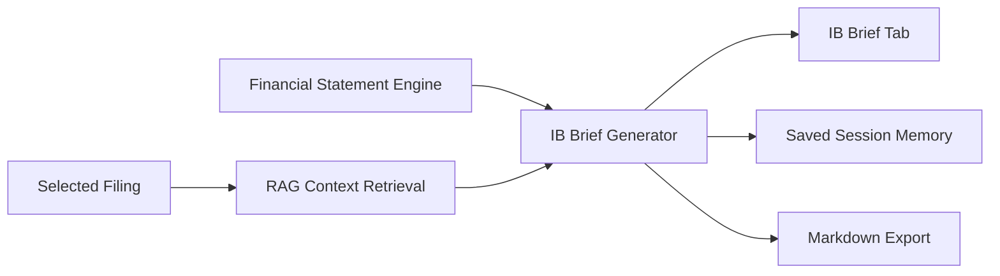

# Phase 5 - IB Analyst Workflow Layer

## Objective

Phase 5 turns filing analysis into banker-facing deliverables.

The app now generates an IB filing brief with:

- Company profile
- Financial snapshot
- Transaction angles
- Diligence questions
- Risk flags
- Recent changes
- Limitations

## Why This Matters

Investment banking analysts rarely need only a generic summary. They need reusable outputs for:

- Pitch prep
- Company profiles
- Management meeting prep
- CIM drafting
- Buyer or sponsor screening
- Diligence request lists

## Architecture

## How To Use

1. Fetch a company filing.
2. Select the filing.
3. Click `Index for RAG`.
4. Optionally click `Extract Financial Statements`.
5. Click `Generate IB Brief`.
6. Review the `IB Brief` tab.
7. Download the brief or save it through session memory.

## Best Practices

- Treat transaction angles as preliminary.
- Use citations and extracted financials as support.
- Verify material facts against the source filing.
- Do not treat the output as investment advice.

## Suggested Exercises

1. Generate an IB brief for AAPL.
2. Add a `Strategic Buyers` section.
3. Add a `Sponsor Considerations` section.
4. Add a 10-K vs 10-Q change analysis section.
5. Export the brief and turn it into a one-page company profile.
